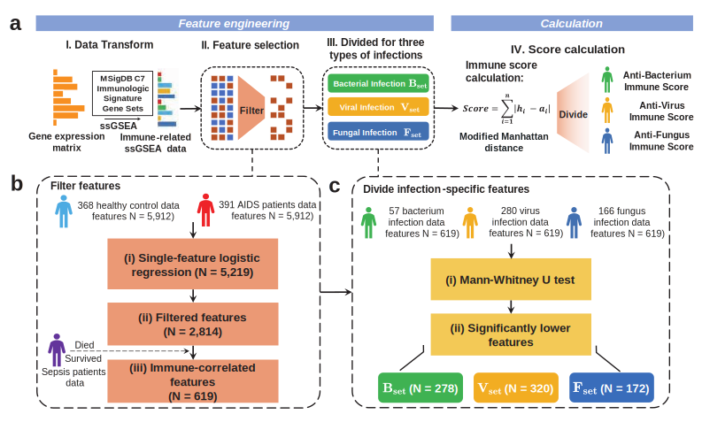

# ImmuDef

## Package: `ImmuDef: A Novel Method for Quantitative Evaluation of Anti-infection Immune Defense Function and its Application`

We created a python package called "ImmuDef" that uses RNA-seq data to compute quantitative assessments of an individual's immune defense function.

# Requirements
## Python Package Requirements
- Python 3.10
- scikit-learn
- numpy
- pandas
## R Package Requirements
- R 4.3.2
- getopt 1.20.4 
- tidyverse 2.0.0
- GSVA 1.50.1
- clusterProfiler 4.10.1
- msigdbr 7.5.1
  
## Test

Run test.py by `python ./main.py `

## Transfer Learn to Your Own Dataset

- Prepare your dataset as a csv file which is ssGSEA data or RNA-seq data.

## Start Compution
- Import this package.
  `from immune_score.score_caculator import Immune_Score_Caculator`
- Read your `csv` file as a `pandas.DataFrame`.
  `data = pd.read_csv('Your_data', index_col=0)`.
- Compute immune scores.
  `isc = Immune_Score_Caculator()`
- Set `data_type` to `'Matrix'` if your  `.csv` files are RNA-seq data.
  `immune_scores = isc.score_compute(data=data,  data_type='Matrix', use_all_to_nor=True)`
- Set `data_type` to `'ssGSEA'` if your `.csv` files are already ssGSEA Data.
  `immune_scores = isc.score_compute(data=data,  data_type='Matrix', use_all_to_nor=True)`

# Cite

If you make use of the code/experiment in your work, please cite our paper (Bibtex below).

@article{
title={''},
author={''},
year={2024}
}
