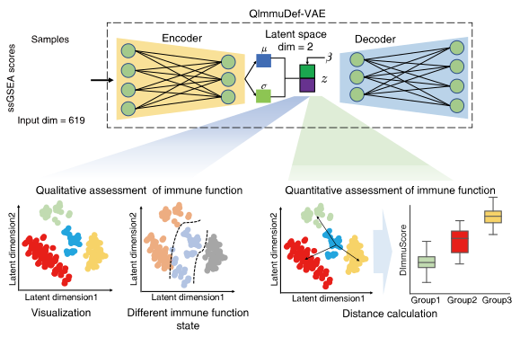

# ImmuDef



## Project: `A deep representation learning method for quantitative immune defense function evaluation and its clinical applications`

# Requirements
## Python Package Requirements
- Python 3.10
- scikit-learn 1.2.2
- numpy 1.23.5
- pandas 1.5.3
- pytorch 2.0.1
## R Package Requirements
- R 4.3.2
- getopt 1.20.4 
- tidyverse 2.0.0
- GSVA 1.50.1
- clusterProfiler 4.10.1
- msigdbr 7.5.1
# 🧬 ssGSEA Immune Pathway Enrichment Analysis (C7 Gene Sets)

This R script performs **single-sample Gene Set Enrichment Analysis (ssGSEA)** using the **MSigDB C7 immunologic signature gene sets**. It takes a gene expression matrix as input and outputs enrichment scores for each sample across all C7 pathways.

---

## 📦 Required R Packages

Make sure the following packages are installed:


> ⚠️ **Note**: This script only supports **human (Homo sapiens)** data due to the use of `org.Hs.eg.db`.

---

## 📁 Input Format

### ✅ Requirements
- **File type**: CSV (comma-separated)
- **Rows**: Genes (using official **HGNC gene symbols**, e.g., `TP53`, `CD3D`)
- **Columns**: Samples
- **Values**: Expression values  
  - Use **raw counts** (e.g., from RNA-seq) → script uses `kcdf="Poisson"`  

## Usage
Example (`input.csv`):
```bash
Rscript Rscript_ssGSEA.R -i input_file.csv -o output_file.csv
```
# Beta-VAE Training Script

This script trains a Beta-VAE model on single-cell RNA sequencing data. Below are the instructions for running the script.

## Prerequisites

Make sure you have the following dependencies installed:

```bash
pip install torch numpy scikit-learn json argparse
```
## Training Model

```bash
python train_model_paras_combine.py
```
## DImmuScore calculation

This script implements the complete computational workflow for deriving the DImmuScore based on QImmuDef-VAE latent representations and ensemble-model–trained reference samples.

### Command-Line Usage
```bash
python run_immudef.py \
  --input data/expression_matrix.csv \
  --vae_model models/QImmuDefVAE.pt \
  --ensemble_model models/ensemble.pkl \
  --gene_list data/immune_gene_list.txt \
  --outdir results/
```
### Required Input Files
Argument	Description
```bash
--input	Expression matrix (.csv or .tsv). Rows = samples,
--vae_model	Pretrained QImmuDef-VAE weights (.pt).
--ensemble_model	Trained ensemble classifier combining SVM, XGBoost and Logistic Regression (.pkl).
--gene_list	List of immune-related genes used during VAE training.
--outdir	Output folder where all results will be saved.
```
