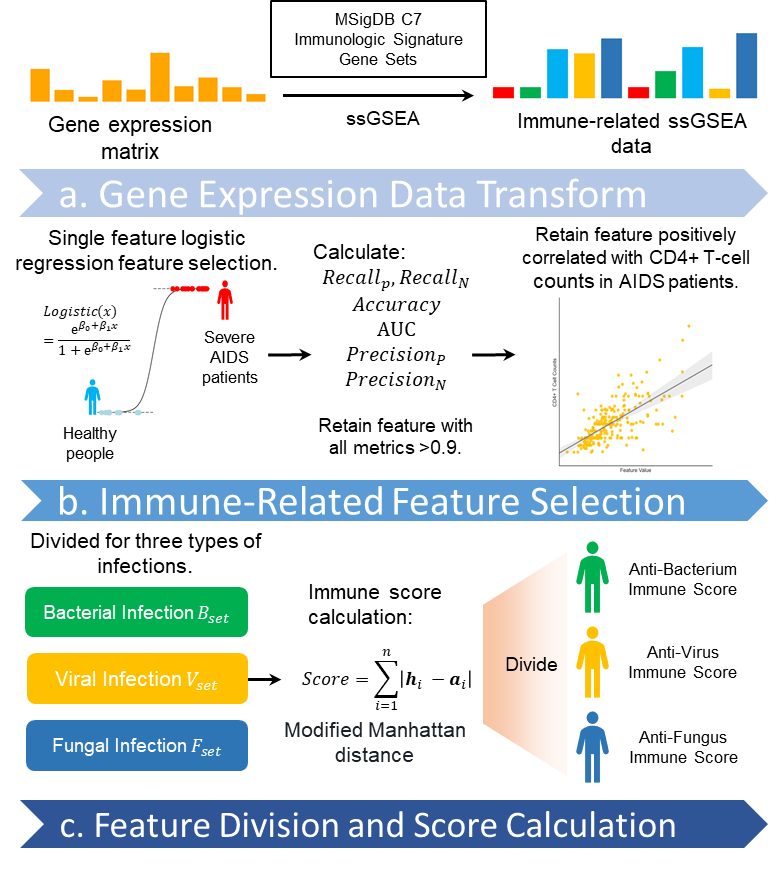

# Immune_Score_Caculator

## Package: `Immune_Score_Caculator`

We created a python package called "Immune_Score_Caculator" that uses RNA-seq data to compute quantitative assessments of an individual's immune function.

# Requirements
- Python 3.10
- scikit-learn
- numpy
- pandas

# Datasets
The SMRT dataset is collect from [this paper](https://doi.org/10.1038/s41467-019-13680-7)
Datasets for transfer learning is download from [PredRet](http://predret.org/)

# Usage

## Test

Run test.py by `python ./main.py `

## Transfer Learn to Your Own Dataset

- Prepare your dataset as a csv file which is ssGSEA data or RNA-seq data.

## Start Compution
- Import this package.
  `from immune_score.score_caculator import Immune_Score_Caculator`
- Read your `csv` file as a `pandas.DataFrame`.
  `data = pd.read_csv('Data/data/ssgsea_TB_c7.csv.bz2', index_col=0)`.
- Compute immune scores.
  `isc = Immune_Score_Caculator()`
  `immune_scores = isc.score_compute(data=data, use_all_to_nor=True)`

# Cite

If you make use of the code/experiment in your work, please cite our paper (Bibtex below).

@article{
title={''},
author={''},
year={2024}
}
